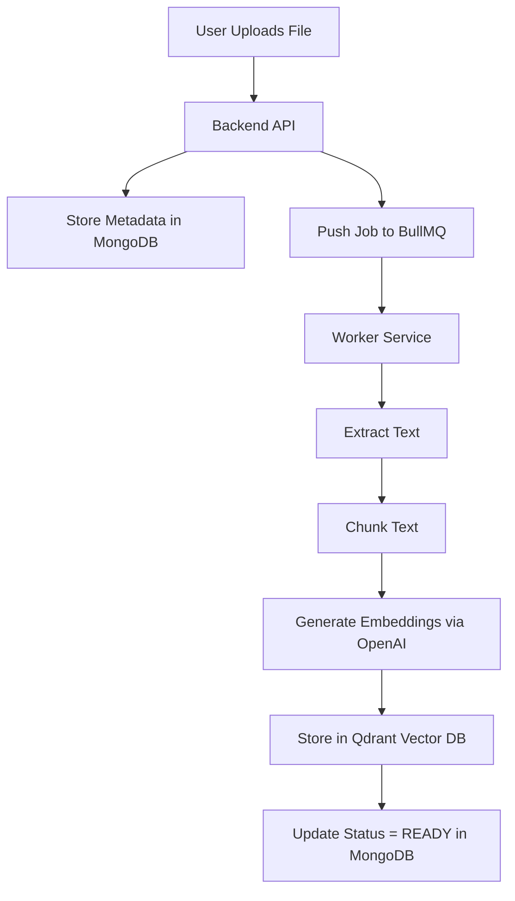
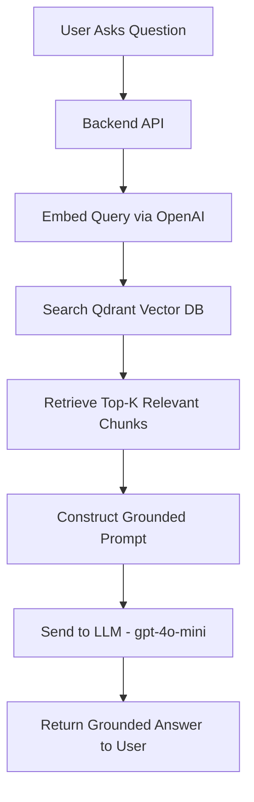
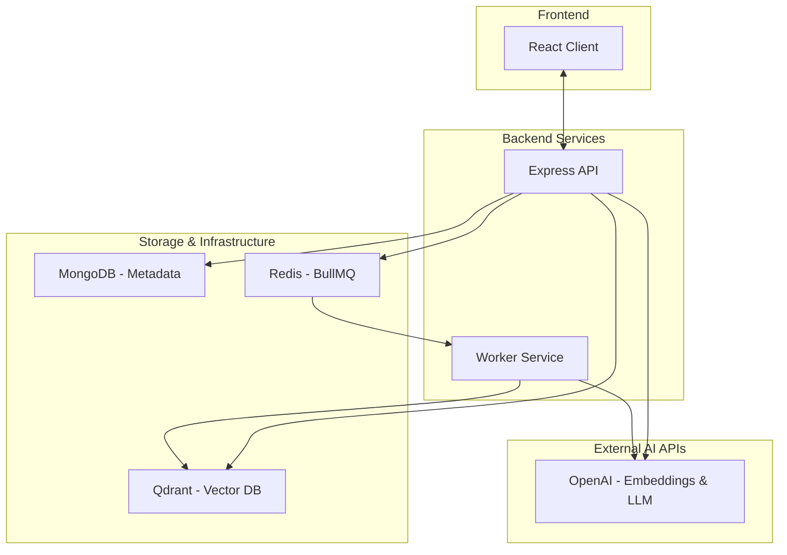
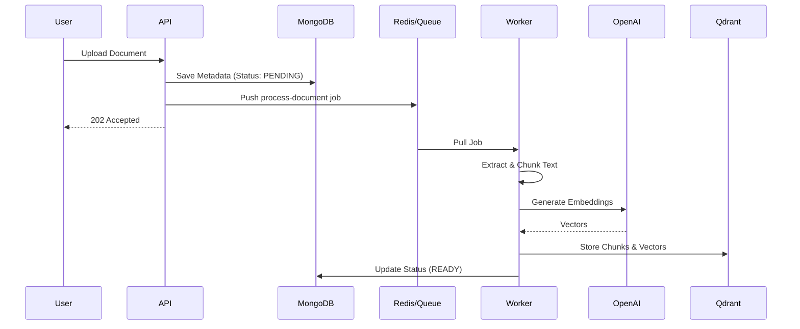
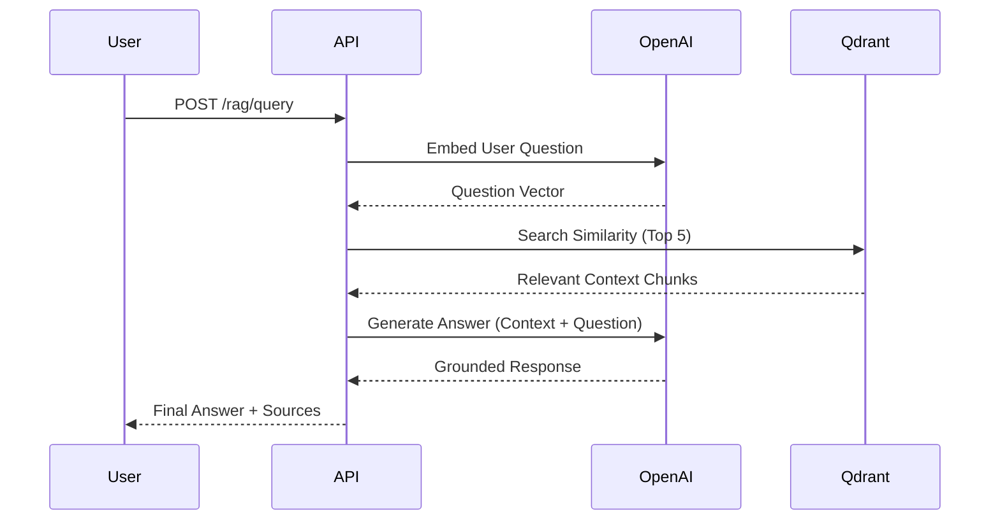

# System Design: RAG Architecture
## Module 2: Architecture Design

This document visualizes the "Request Lifecycle" of our Retrieval-Augmented Generation (RAG) system, covering both the data ingestion and semantic retrieval pipelines.

---

## 1. System Overview
The system is designed to provide grounded AI responses by indexing private documents and retrieving them as context. Key capabilities include:
*   **Document Upload:** Secure handling of user files.
*   **Background Processing:** Asynchronous document processing to ensure high availability.
*   **Embedding Storage:** Storing semantic vectors in a high-performance vector database.
*   **Semantic Retrieval:** Finding relevant context based on vector similarity.
*   **Grounded Response Generation:** Using an LLM (GPT-4o-mini) to generate answers based strictly on retrieved context.

---

## 2. Ingestion Path
**Goal:** Convert raw documents into searchable semantic vectors.

### Ingestion Flow

### Step-by-Step Explanation
1.  **File Upload (`POST /documents/upload`):** Validates type/size and stores metadata in MongoDB.
2.  **Queue Job:** Uses BullMQ to prevent blocking the user request during heavy computation.
3.  **Worker Processing:**
    *   **Extraction:** Uses `pdf-parse` or `mammoth`.
    *   **Chunking:** 800 tokens with 150-token overlap.
    *   **Embedding:** Calls OpenAI API to get a 1536-dimension vector (standard for text-embedding-3-small/ada-002).
    *   **Storage:** Saves chunk text and metadata (userId, docId, page) in Qdrant.

---

## 3. Retrieval Path
**Goal:** Answer user questions using stored semantic context.

### Retrieval Flow

### Step-by-Step Explanation
1.  **Receive Query:** `POST /rag/query` receives the user's question.
2.  **Embed Query:** The question is converted into a vector so it can be compared to stored chunks.
3.  **Search Vector DB:** Performs a similarity search (Top K=5) with multi-tenant filtering (userId).
4.  **Prompt Construction:** The retrieved chunks are injected into a prompt template that instructs the LLM to answer **only** using the provided context.
5.  **Call LLM:** `gpt-4o-mini` generates the final response based on the "grounded" information.

---

## 4. Full System Diagram
### Logical Architecture

---

## 5. Sequence Diagram (Request Lifecycle)

### Ingestion Lifecycle

### Retrieval Lifecycle

