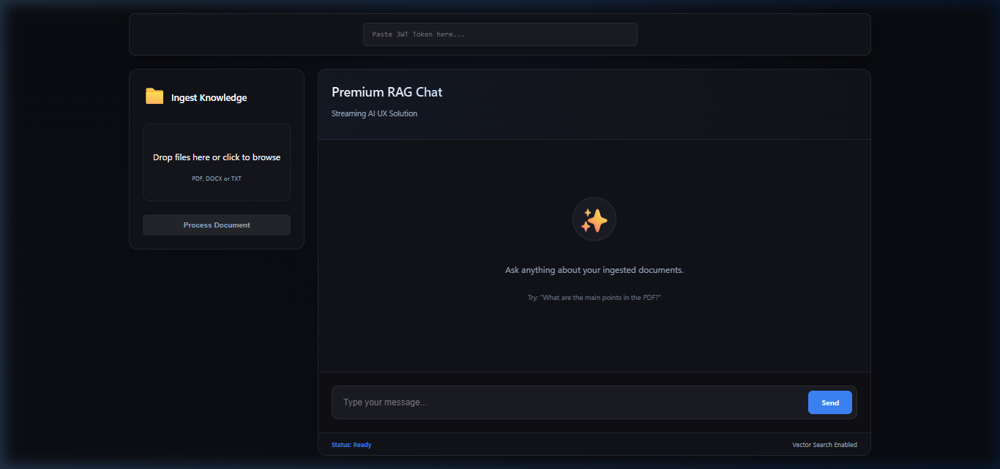
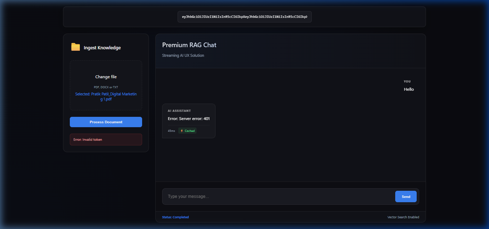
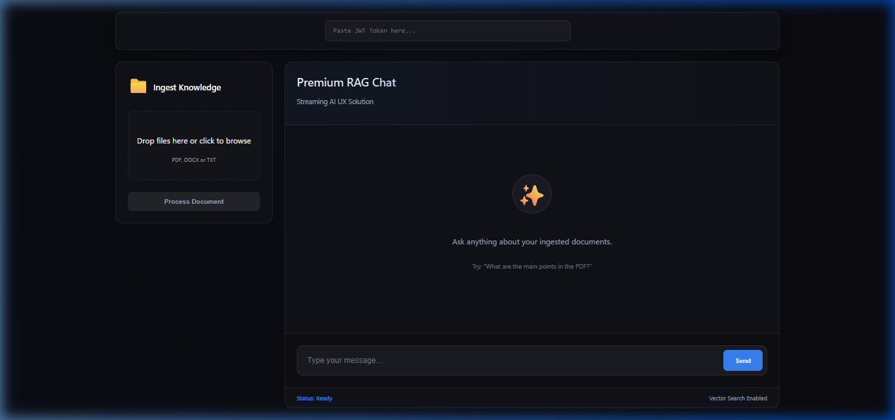

<div align="center">

# 🧠 DocuMind

### Enterprise RAG SaaS Platform — Intelligent Document Ingestion, Semantic Search & AI Chat

[](https://nodejs.org/)
[](https://www.typescriptlang.org/)
[](https://expressjs.com/)
[](https://react.dev/)
[](https://ai.google.dev/)
[](LICENSE)

<br/>

> **DocuMind** is a production-grade, multi-tenant Retrieval-Augmented Generation platform. Upload PDFs or DOCX files, watch them get chunked and embedded in real-time via background workers, then ask natural-language questions grounded exclusively in your own documents — with streaming AI responses, Redis caching, and full deployment readiness.

<br/>

   

</div>

---

## 📋 Table of Contents

- [Overview](#-overview)
- [Features](#-features)
- [Architecture](#-architecture)
- [Tech Stack](#-tech-stack)
- [Project Structure](#-project-structure)
- [Installation](#-installation)
- [Usage](#-usage)
- [API Reference](#-api-reference)
- [Configuration](#-configuration)
- [Testing](#-testing)
- [Security Notes](#-security-notes)
- [Deployment](#-deployment)
- [Design Decisions](#-design-decisions)

---

## 🧠 Overview

DocuMind solves a real enterprise workflow: turning unstructured documents into queryable knowledge. The backend accepts multi-format files, processes them through a BullMQ background worker (Extract → Chunk → Embed → Qdrant), caches responses with Redis, and streams grounded AI answers to a premium React dashboard.

Users can:

- Upload PDF or DOCX documents and watch a live progress bar during embedding
- Ask natural-language questions answered strictly from their own uploaded files
- Receive real-time streaming responses via Server-Sent Events (SSE)
- Benefit from Redis-backed semantic caching for instant repeat answers
- Operate in a fully multi-tenant environment where each user's data is isolated

---

## 🚀 Live Demo
**Production URL**: [https://documind-kohl.vercel.app/](https://documind-kohl.vercel.app/)

---

## 📸 Application Preview

<div align="center">
  <h3>1. Secure Login Portal</h3>
  
  <br/>
  
  <h3>2. Intelligent Dashboard (Empty State)</h3>
  
  <br/>
  
  <h3>3. Real-time Background Ingestion</h3>
  
  <br/>
  
  <h3>4. Vectorization & Indexing Complete</h3>
  
  <br/>
  
  <h3>5. Streaming RAG Chat with Citations</h3>
  
</div>

---

## ✨ Features

| Feature | Description |
|---|---|
| 📄 **Multi-Format Document Ingestion** | Accepts PDF (`pdf-parse`) and DOCX (`mammoth`) uploads with MIME-type validation |
| 🔄 **BullMQ Background Workers** | Heavy extraction/chunking/embedding runs in a separate process — API never blocks |
| 📊 **Embedding Progress Bar** | Real-time indeterminate progress bar with status polling (`PROCESSING` → `COMPLETED`) |
| 🧩 **Recursive Text Chunking** | 800-char chunks with 150-char overlap using a hierarchical paragraph → newline → sentence splitter |
| 🧠 **Gemini Embedding + Generation** | Google `gemini-embedding-2` for 768-dim vectors, `gemini-2.5-flash` for strict grounded answers |
| 🔍 **Qdrant Vector Search** | Multi-tenant semantic retrieval with mandatory `userId` payload filtering |
| 💬 **Streaming SSE Chat** | Server-Sent Events deliver AI tokens in real-time with `AbortController` cancellation support |
| ⚡ **Redis Semantic Caching** | SHA-256 identity-aware cache keys; repeat queries return in <15ms with ⚡ Cache badge |
| 🛡️ **Prompt Injection Guard** | Detects and blocks common injection patterns before they reach the LLM |
| 📌 **Citation-Enforced Prompts** | Temperature-0 generation with strict "answer only from context" system prompts |
| 🔐 **JWT Multi-Tenant Auth** | Every request is scoped to a verified user; vector search is tenant-isolated |
| ⏱️ **Rate Limiting** | `express-rate-limit` caps chat routes at 10 req/min per IP to protect API credits |
| 📈 **Production Monitoring Logs** | Tracks prompt length, cache hit ratio, and worker job progress in structured logs |
| 🚀 **Railway + Vercel Deployment Ready** | Dual-service Railway config (API + Worker) and Vite env-driven frontend for Vercel |
| 🎨 **Premium Dark Theme UI** | Glassmorphism design with micro-animations, gradient text, and responsive layout |

---

## 🏗️ Architecture

```
┌───────────────────────────────────────────────────────────────────┐
│                     React Frontend (Vercel)                       │
│                                                                   │
│  FileUpload ──► Progress Bar ──► Chat (SSE Streaming)             │
│      │              │                    │                        │
│      └─── POST /upload ──┐    GET /chat/stream ◄─────┘            │
│                          │                                        │
└──────────────────────────┼────────────────────────────────────────┘
                           │
                           ▼
┌───────────────────────────────────────────────────────────────────┐
│                   Express Backend (Railway)                        │
│                                                                   │
│  Middleware: CORS + JWT Auth + Rate Limiting + Multer              │
│                                                                   │
│  POST /upload ─► upload.controller ─► ingestionQueue.add()         │
│  GET  /chat   ─► cache check ─► retrieval ─► LLM ─► cache set     │
│  GET  /stream ─► cache check ─► retrieval ─► LLM stream ─► SSE    │
│  GET  /files/:id/status ─► MongoDB status polling                  │
│                                                                   │
└───────────┬───────────────────────────────────────────────────────┘
            │
            ▼
┌───────────────────────────────────────────────────────────────────┐
│                   Background Worker (Railway)                      │
│                                                                   │
│  BullMQ Consumer ─► Extract Text ─► Chunk (800/150)                │
│                  ─► Gemini Embed ─► Qdrant Upsert                  │
│                  ─► MongoDB status: COMPLETED / FAILED             │
│                                                                   │
└───────────────────────────────────────────────────────────────────┘
            │
            ▼
┌─────────────┐  ┌─────────────┐  ┌─────────────┐  ┌─────────────┐
│  Redis      │  │  MongoDB    │  │  Qdrant     │  │  Gemini API │
│  Cache +    │  │  File Meta  │  │  Vectors    │  │  Embed +    │
│  BullMQ     │  │  + Status   │  │  + Payloads │  │  Generate   │
└─────────────┘  └─────────────┘  └─────────────┘  └─────────────┘
```

---

## 🛠️ Tech Stack

| Layer | Technology |
|---|---|
| **Runtime** | Node.js 22, TypeScript 6, Express 5 |
| **AI Provider** | Google Gemini (`gemini-2.5-flash` + `gemini-embedding-2`) |
| **Vector Database** | Qdrant (Cosine similarity, 768-dim vectors) |
| **Job Queue** | BullMQ + Redis (IORedis) |
| **Metadata Store** | MongoDB Atlas (Mongoose ODM) |
| **Caching** | Redis with SHA-256 identity-aware keys |
| **Document Processing** | `pdf-parse`, `mammoth` |
| **Frontend** | React 18, Vite, TypeScript, Custom CSS (Glassmorphism) |
| **Auth** | JWT (`jsonwebtoken`) |
| **Security** | `express-rate-limit`, Prompt injection guard |
| **Deployment** | Railway (Backend + Worker), Vercel (Frontend) |

---

## 📁 Project Structure

```
RAG-11/
│
├── backend/
│   ├── src/
│   │   ├── controllers/
│   │   │   ├── chat.controller.ts       # RAG pipeline + cache + streaming SSE
│   │   │   ├── file.controller.ts       # Status polling endpoint
│   │   │   └── upload.controller.ts     # File upload + BullMQ job enqueue
│   │   ├── middlewares/
│   │   │   ├── auth.middleware.ts        # JWT verification + tenant scoping
│   │   │   ├── rateLimit.middleware.ts   # 10 req/min per IP on chat routes
│   │   │   └── upload.middleware.ts      # Multer config + MIME validation
│   │   ├── models/
│   │   │   └── file.model.ts            # Mongoose schema (PROCESSING/COMPLETED/FAILED)
│   │   ├── queues/
│   │   │   └── ingestion.queue.ts       # BullMQ queue definition
│   │   ├── routes/
│   │   │   ├── chat.routes.ts           # /chat + /chat/stream (rate limited)
│   │   │   └── upload.routes.ts         # /upload + /files/:id/status
│   │   ├── services/
│   │   │   ├── cache.service.ts         # Redis singleton + in-memory fallback
│   │   │   ├── chunk.service.ts         # RecursiveCharacterTextSplitter (800/150)
│   │   │   ├── embedding.service.ts     # Gemini batch embedding (768-dim)
│   │   │   ├── extraction.service.ts    # PDF/DOCX text extraction
│   │   │   ├── ingestion.service.ts     # Orchestrates chunk → embed → upsert
│   │   │   ├── llm.service.ts           # Gemini generation (standard + stream)
│   │   │   ├── prompt.service.ts        # Strict citation prompts + injection guard
│   │   │   ├── retrieval.service.ts     # Multi-tenant Qdrant vector search
│   │   │   ├── upload.service.ts        # File persistence logic
│   │   │   └── vectorStore.service.ts   # Qdrant collection init + upsert
│   │   ├── tests/
│   │   │   ├── automated-tests.ts       # Full pipeline validation
│   │   │   ├── seed-data.ts             # Qdrant seeder for demo
│   │   │   ├── test-resume-direct.ts    # Direct ingestion test
│   │   │   └── test-streaming.ts        # SSE streaming test
│   │   ├── utils/
│   │   │   ├── fileSwitcher.ts          # Format router (PDF/DOCX)
│   │   │   └── hash.util.ts            # SHA-256 cache key generator
│   │   ├── workers/
│   │   │   └── ingestion.worker.ts      # BullMQ background consumer
│   │   ├── app.ts                       # Express app setup + middleware
│   │   └── server.ts                    # Entry point + MongoDB connection
│   ├── .env.example
│   ├── tsconfig.json
│   └── package.json
│
├── frontend/
│   ├── src/
│   │   ├── components/
│   │   │   ├── Chat.tsx                 # SSE streaming chat with cache badges
│   │   │   ├── Chat.css                 # Chat panel dark theme
│   │   │   ├── FileUpload.tsx           # Upload + progress bar + status polling
│   │   │   └── FileUpload.css           # Upload area + progress animation
│   │   ├── App.tsx                      # Layout + JWT token manager
│   │   ├── App.css                      # App-level grid layout
│   │   ├── config.ts                    # API_BASE (env-driven for Vercel)
│   │   └── index.css                    # Design system (glassmorphism + vars)
│   ├── vite.config.ts
│   └── package.json
│
├── deployment/
│   └── README.md                        # Railway + Vercel deployment guide
│
├── docs/                                # Documentation assets
└── README.md
```

---

## 🚀 Installation

### 1) Clone

```bash
git clone https://github.com/crastatelvin/TAYANA-ASSIGNMENTS.git
cd "TAYANA-ASSIGNMENTS/RAG HANDS ON/RAG ASSIGNMENT 11"
```

### 2) Backend

```bash
cd backend
npm install
copy .env.example .env
# Fill in your GEMINI_API_KEY, MONGO_URI, REDIS_URL, QDRANT_URL, JWT_SECRET
npm run dev
```

### 3) Worker (separate terminal)

```bash
cd backend
npx ts-node src/workers/ingestion.worker.ts
```

### 4) Frontend (separate terminal)

```bash
cd frontend
npm install
npm run dev
```

Frontend: `http://localhost:5173`
Backend: `http://localhost:3001`

---

## 💻 Usage

1. Open the frontend and paste a valid JWT token into the auth field
2. Upload a PDF or DOCX document via the drag-and-drop area
3. Watch the animated progress bar as the background worker processes:
   - `PROCESSING` → Extracting → Chunking → Embedding
   - `COMPLETED` → Success notification
4. Switch to the Chat panel and ask questions about your document
5. Watch AI responses stream in real-time via SSE
6. Repeat the same query to see the ⚡ **Cached** badge appear (<15ms response)

Generate a test JWT token:

```bash
node -e "const jwt = require('jsonwebtoken'); console.log(jwt.sign({ id: 'test-user' }, 'your_jwt_secret'))"
```

---

## 📡 API Reference

| Method | Endpoint | Auth | Description |
|---|---|---|---|
| `POST` | `/api/upload` | JWT | Upload file → returns `202` with `fileId`, enqueues BullMQ job |
| `GET` | `/api/files/:fileId/status` | JWT | Poll background worker status (`PROCESSING` / `COMPLETED` / `FAILED`) |
| `GET` | `/api/chat?q=<query>` | JWT + Rate Limit | Standard RAG query → JSON response with `answer`, `sources`, `cached` |
| `GET` | `/api/chat/stream?q=<query>` | JWT + Rate Limit | SSE streaming RAG → real-time token delivery, ends with `[DONE]` |

---

## ⚙️ Configuration

`backend/.env`:

```bash
PORT=3001
GEMINI_API_KEY=your_gemini_api_key
MONGO_URI=mongodb+srv://...
REDIS_URL=redis://localhost:6379
QDRANT_URL=http://localhost:6333
QDRANT_API_KEY=your_qdrant_api_key
JWT_SECRET=your_jwt_secret
```

`frontend/.env` (for Vercel production):

```bash
VITE_API_BASE=https://your-rag-api.up.railway.app/api
```

---

## 🧪 Testing

### Automated Pipeline Test

```bash
cd backend
npx ts-node src/tests/automated-tests.ts
```

### Seed Demo Data

```bash
npx ts-node src/tests/seed-data.ts
```

### Streaming Test

```bash
npx ts-node src/tests/test-streaming.ts
```

### Rate Limit Test

```bash
# Send 12 rapid requests — last 2 should return 429
1..12 | ForEach-Object { curl.exe -s -w "%{http_code}" -H "Authorization: Bearer <token>" http://localhost:3001/api/chat?q=test }
```

---

## 🔒 Security Notes

- **JWT Authentication** verifies every request and scopes vector search to the authenticated user
- **Multi-Tenant Isolation** — Qdrant queries include a mandatory `userId` filter; User A never sees User B's documents
- **Rate Limiting** — `express-rate-limit` enforces 10 requests/minute per IP on all chat endpoints
- **Prompt Injection Guard** — `PromptService.isSafe()` blocks common injection patterns before they reach Gemini
- **Upload Validation** — Multer restricts file types to PDF and DOCX with MIME-type checking
- **CORS** is enabled and should be locked to your frontend origin in production

---

## 🚀 Deployment

### Backend → Railway

1. Connect your GitHub repo to [Railway](https://railway.app)
2. Set environment variables (`PORT=8080`, `MONGO_URI`, `REDIS_URL`, `QDRANT_URL`, `GEMINI_API_KEY`, `JWT_SECRET`)
3. **Service 1** — Start command: `npm run start` (API server)
4. **Service 2** — Same repo, start command: `npm run worker` (Background worker)

### Frontend → Vercel

1. Import repo to [Vercel](https://vercel.com), set root directory to `frontend`
2. Add env variable: `VITE_API_BASE=https://your-rag-api.up.railway.app/api`
3. Deploy

See [`deployment/README.md`](./deployment/README.md) for the full guide.

---

## 🧭 Design Decisions

- **BullMQ over in-process**: Heavy PDF extraction + Gemini API calls moved to a separate worker so the API thread never blocks — critical for handling large files without crashing the server
- **Redis dual-purpose**: Single Redis instance serves both BullMQ job brokering and semantic response caching, minimizing infrastructure overhead
- **Recursive chunking with overlap**: 800-char chunks with 150-char overlap preserves paragraph boundaries and sentence continuity for better retrieval quality
- **Empty chunk filtering**: `RecursiveCharacterTextSplitter` explicitly filters out empty strings before embedding to prevent Gemini 400 errors on malformed documents
- **Temperature-0 generation**: All LLM calls use `temperature: 0` to eliminate hallucination and enforce strict grounding in retrieved context
- **Identity-aware cache keys**: `SHA-256(userId + query)` ensures cached responses are tenant-isolated and never leak across users
- **Indeterminate progress bar**: Since BullMQ doesn't expose granular step progress, an animated CSS progress bar provides visual feedback during the full Extract → Chunk → Embed pipeline

---

<div align="center">

Built by Telvin Crasta · Production-ready · Live today

⭐ If DocuMind helped you build smarter document intelligence, star the repo.

</div>
